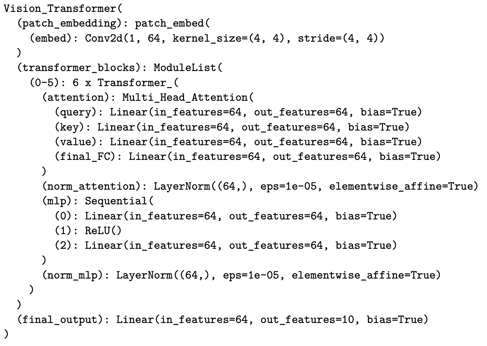
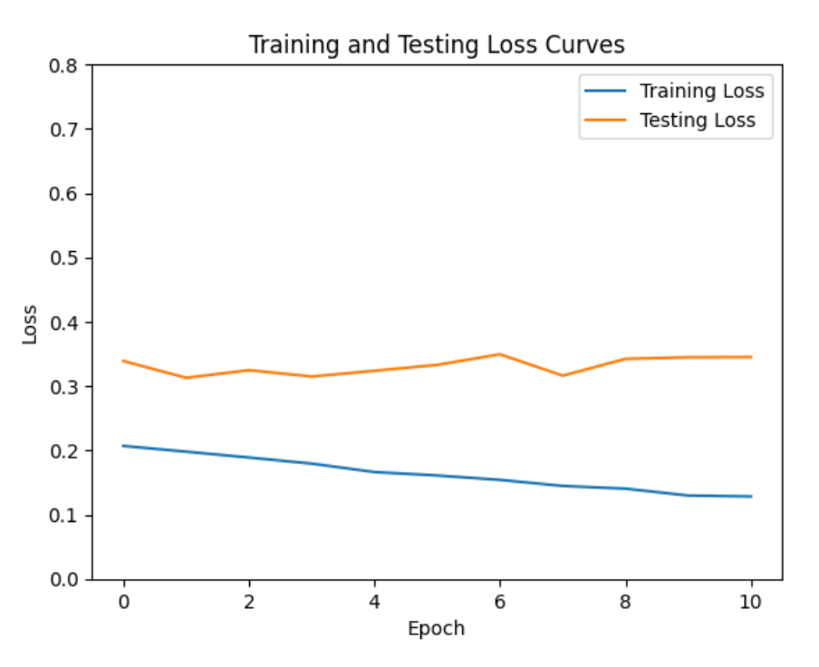
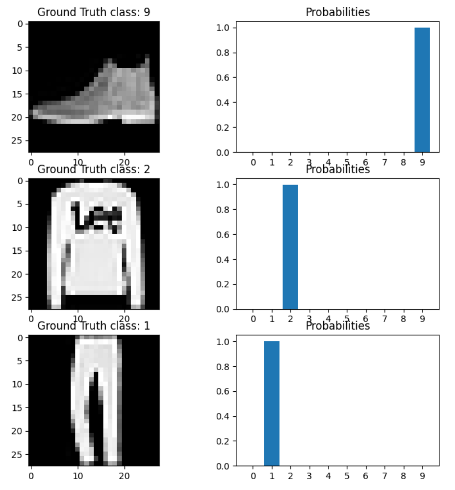

# Vision Transformer

In this project we trained a vision transformer to classify images from the FashionMNIST dataset. We specifically used  a patch size of 4x4, 6 ViT layers, and 4 heads for our ViT.

For doing so, we first convert an input image into a sequence of patches (with patch size equal to 4, as specified), where each patch is embedded into a lower-dimensional space, and then fed into a transformer-based model for image classification. We then implement the multi-head attention mechanism from scratch, and finally define the vision transformer module, using 6 ViT layers and 4 heads, with 10 output classes for the classification task. For this project we used the cross entropy loss function since it is suitable for multi-class classifcation tasks. We also used the Adam optimizer and set the learning rate to 0.001.

We can see the model architecture as below:

We visualize the train and test loss curves as below:

With these settings, we were able to achieve a final accuracy of 89.33% on our test set.

We plot images with predicted probabilities as below. We can see that the model predicts the true label with high probability.

